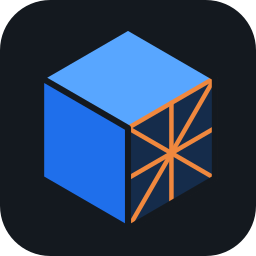
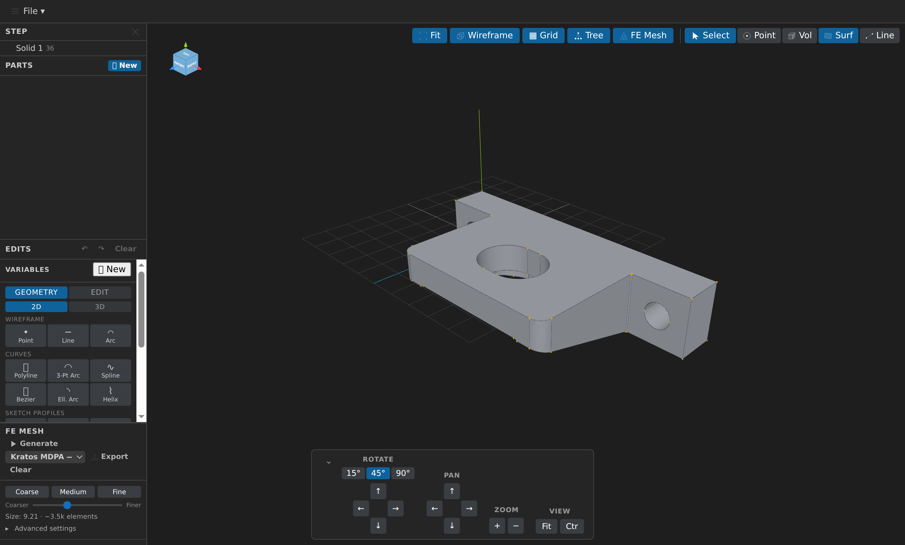
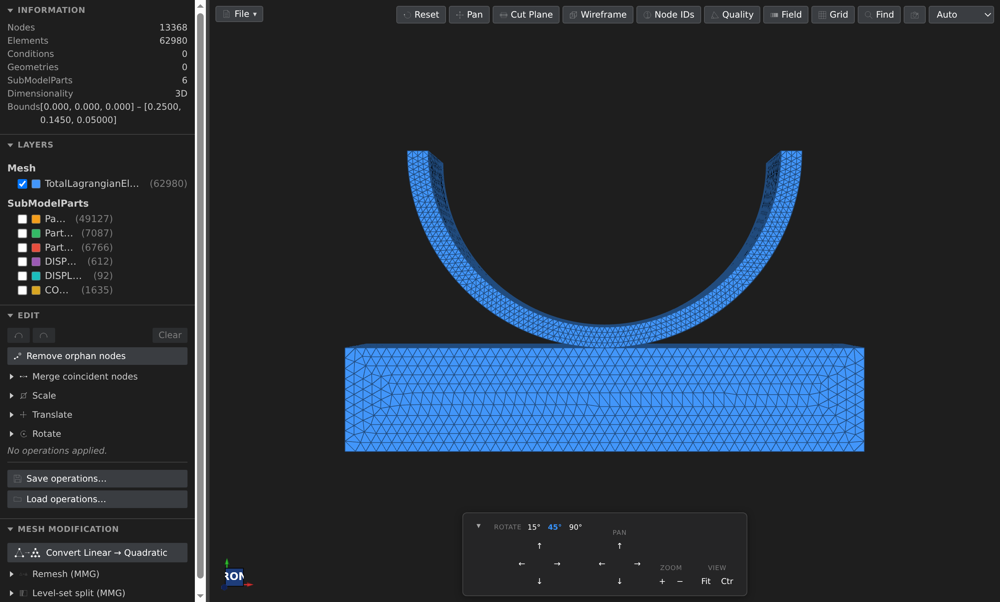

<div align="center">
  
</div>

# KKSS — Keep Kratos Simple Stupid

[](https://github.com/loumalouomega/KKSS/actions/workflows/ci.yml) [](https://github.com/loumalouomega/KKSS/releases) [](https://loumalouomega.github.io/KKSS/) [](https://www.electronjs.org/) [](https://threejs.org/) [](https://kitware.github.io/vtk-js/) [](https://ocjs.org/) [](https://gmsh.info/) [](https://www.mmgtools.org/) [](https://www.typescriptlang.org/) [](LICENSE)

<div align="center">
  
  
</div>

A cross-platform desktop application for **pre- and post-processing [Kratos Multiphysics](https://github.com/KratosMultiphysics/Kratos) simulations**, built with Electron on top of two proven VS Code extensions, embedded as git submodules and reused **without modification**:

| Mode | Engine (submodule) | What it does |
| --- | --- | --- |
| 🔷 **Pre-Processing** | [CAD-Preview](https://github.com/loumalouomega/CAD-Preview) (`cad/`) | STEP/IGES/BREP + STL/OBJ/PLY/glTF viewing, part definition, parametric geometry editing, Gmsh FE meshing, MDPA export |
| 🔶 **Post-Processing** | [VSCode-MDPA-Preview](https://github.com/loumalouomega/VSCode-MDPA-Preview) (`mesh/`) | MDPA/VTK inspection plus 29 extended mesh formats via meshio++ (Gmsh, Abaqus, Nastran, UNV, SU2, …), combinable field modes (contour/isosurface/quiver/deformed shape) & time-series visualization, mesh quality & mesh-size analysis, mesh operations with undo/redo, MMG remeshing, Kratos case setup & runs via built-in problemtypes (incl. the Flowgraph node-editor) |

The app opens on a **home screen** with one button per task; a toolbar toggle (and `Ctrl+0` for Home) switches between the screens, and both viewers stay alive, keeping their loaded file, camera, and history. Also in the box:

- **AI assistant** (`Ctrl+Shift+L`) — a chat sidebar where an LLM (Anthropic Claude or any OpenAI-compatible backend) drives CAD editing, meshing, case setup, and Kratos runs through the engines' MCP tool servers plus the [kratos-mcp-server](https://pypi.org/project/kratos-mcp-server/) (project scaffolding, multi-stage orchestration, presets, ProjectParameters explain, Flowgraph interop, and worked-example resources); API key configured in the Settings menu, stored via the OS keychain. The same unified toolset can be exposed to an **external** MCP client — Claude Code, GitHub Copilot, Claude Desktop — over a localhost Streamable HTTP endpoint via **Settings ▸ MCP Server** (off by default, bearer-token protected); see [Use your own MCP client](doc/guide/getting-started.md#use-your-own-mcp-client) for the one-line Claude Code and Copilot setup.
- **Embedded terminal** (``Ctrl+` ``) — a real PowerShell/`$SHELL` panel below the viewer for launching Kratos runs, powered by node-pty + xterm.js.
- **Text editor** — a lightweight CodeMirror 6 editor for input files and scripts (JSON/Python highlighting, dirty-state guards).
- **About & updates** — Help ▸ About checks GitHub for new releases and can download + install them in place (Windows installer and Linux AppImage).
- **Settings menu** — color theme (shared with the mesh viewer), terminal shell, and LLM assistant provider/keys, persisted across runs.

**Documentation:** <https://loumalouomega.github.io/KKSS/> · **Downloads:** [download page](https://loumalouomega.github.io/KKSS/download) ([GitHub Releases](https://github.com/loumalouomega/KKSS/releases)) — Linux x86-64/ARM 64, Windows x86-64/ARM 64, macOS Apple Silicon

## How it works

Both extensions already separate a browser-side viewer bundle (whose only VS Code touchpoint is `acquireVsCodeApi()`) from thin vscode-coupled glue. KKSS loads the built viewer bundles unchanged behind a tiny shim and provides Electron equivalents of the glue: native dialogs, a `vscode` module shim for the reused mesh host code, custom `kkss://`/`kkss-file://` schemes in place of `asWebviewUri`, and worker threads for the heavy WASM kernels (OpenCascade, Gmsh, MMG). Upstream extension improvements are inherited by bumping a submodule pointer. See the [architecture guide](https://loumalouomega.github.io/KKSS/guide/development) for details.

## Building from source

```bash
git clone --recurse-submodules https://github.com/loumalouomega/KKSS.git
cd KKSS
npm ci
npm run submodules:install
npm start          # build everything and launch
npm run dist       # package installers into release/
```

See [CONTRIBUTING.md](CONTRIBUTING.md) for the development workflow, testing, and the submodule update procedure.

### Run in a browser (Docker)

The unmodified app can also be streamed to a browser tab from a Docker
container (Xvfb + noVNC; single-user/demo scope). A prebuilt linux/amd64
image is published to [Docker Hub](https://hub.docker.com/r/vmataix/kkss)
on every release:

```bash
docker run -d -p 6080:6080 --shm-size=1g vmataix/kkss:latest
# then open http://localhost:6080/vnc.html
```

Or build it yourself from a checkout with initialized submodules:

```bash
git submodule update --init --recursive
docker compose up --build     # then open http://localhost:6080/vnc.html
```

See the [web deployment guide](https://loumalouomega.github.io/KKSS/guide/web-deployment) for volumes, environment variables, and security caveats.

## Licensing

KKSS is licensed **AGPL-3.0** (see [LICENSE](LICENSE)). It bundles the GPL-2.0-or-later licensed CAD-Preview engine — whose shipped WASM statically links [Gmsh](https://gmsh.info) and OpenCASCADE — and the AGPL-3.0-or-later licensed VSCode-MDPA-Preview engine, whose Flowgraph problemtype embeds the AGPL-3.0 [`@kratos-flowgraph/flowgraph`](https://www.npmjs.com/package/@kratos-flowgraph/flowgraph) node editor; AGPL-3.0 is the compatible license for the combined distribution.
